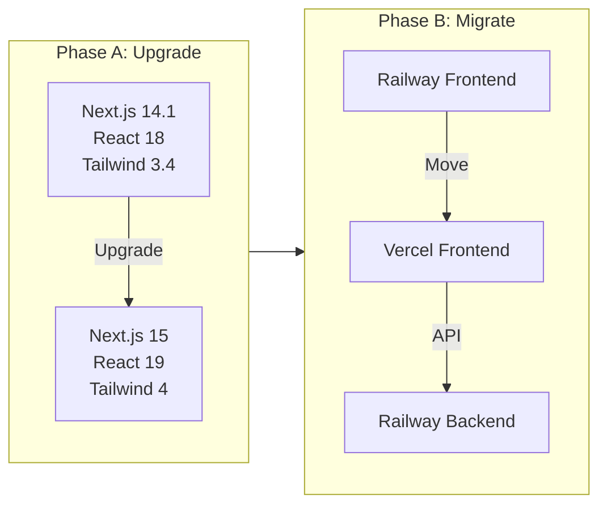

# Stack Upgrade + Vercel Migration Agent Pipeline

This pipeline uses the RALPH (Recursive Agentic Loop for Progressive Handling) workflow with specialized agents executing in sequence across two major phases.

## Why This Order?

| Issue | Severity | Solution |

|-------|----------|----------|

| **CVE-2025-29927** | Critical (CVSS 9.1) | Upgrade Next.js 14.1.0 to 15.x |

| React 18 EOL | Medium | Required by Next.js 15 |

| Tailwind 3.x | Low | Modernize while upgrading |

| Railway frontend | N/A | Migrate to Vercel for better DX |

**Upgrade first, then migrate** ensures:

1. Security vulnerability fixed immediately
2. One platform to test (Railway) before adding Vercel complexity
3. Vercel deployment uses modern stack from day one

---

## Architecture Journey



---

## Agent Pipeline

| Order | Phase | Agent | Role | Slash Command |

|-------|-------|-------|------|---------------|

| 1 | A | Stack Upgrade Architect | Plan upgrade | `/stack-upgrade-architect` |

| 2 | A | Stack Upgrade Builder | Execute upgrade | `/stack-upgrade-builder` |

| 3 | A | Upgrade QA | Verify on Railway | `/upgrade-qa` |

| 4 | B | Infra Architect | Backend CORS | `/vercel-infra-architect` |

| 5 | B | Frontend Architect | Vercel config | `/vercel-frontend-architect` |

| 6 | B | Vercel Builder | Deploy | `/vercel-builder` |

| 7 | B | Migration QA | Final verify | `/vercel-qa` |

---

## Phase A: Stack Upgrade

### A.1 Stack Upgrade Architect

**Agent File:** `.cursor/agents/STACK_UPGRADE_ARCHITECT.md`

**Context Files:**

1. `.cursor/workflow_guide.md`
2. `.cursor/active_context.md` (update first)
3. `frontend/package.json`
4. `frontend/tailwind.config.ts`
5. `frontend/src/app/globals.css`

**Breaking Changes to Analyze:**

Next.js 14 to 15:

- `cookies()`, `headers()`, `params`, `searchParams` now async (need `await`)
- `fetch` and Route Handlers no longer cached by default
- React 19 required

Tailwind 3 to 4:

- CSS-first config: `@import "tailwindcss"` replaces `@tailwind` directives
- Removed: `text-opacity-*`, `bg-opacity-*` (use `/50` modifiers)
- Renamed: `flex-grow` to `grow`, `flex-shrink` to `shrink`
- PostCSS plugin now separate: `@tailwindcss/postcss`
- ESM-only modules

**Output:** `.cursor/specs/upgrade_spec.md` with:

- List of files needing async API changes
- List of Tailwind class migrations
- Configuration file changes
- Codemod commands to run

**Handoff:** Notify user to run `/stack-upgrade-builder`

---

### A.2 Stack Upgrade Builder

**Agent File:** `.cursor/agents/STACK_UPGRADE_BUILDER.md`

**Tasks:**

1. Update dependencies in `frontend/package.json`:
```json
{
  "dependencies": {
    "next": "^15.1.0",
    "react": "^19.0.0",
    "react-dom": "^19.0.0",
    "tailwindcss": "^4.0.0"
  },
  "devDependencies": {
    "@tailwindcss/postcss": "^4.0.0",
    "@types/react": "^19.0.0",
    "@types/react-dom": "^19.0.0",
    "eslint-config-next": "^15.1.0"
  }
}
```

2. Run codemods:
```bash
cd frontend
npx @next/codemod@canary next-async-request-api .
npx @tailwindcss/upgrade
```

3. Update `frontend/postcss.config.js`:
```javascript
module.exports = {
  plugins: {
    '@tailwindcss/postcss': {},
    autoprefixer: {},
  },
}
```

4. Update `frontend/src/app/globals.css`:
```css
@import "tailwindcss";
/* ... rest of styles ... */
```

5. Fix any remaining manual changes from upgrade_spec.md

6. Build and test:
```bash
npm run build
npm run lint
npm run dev
```

7. Deploy to Railway:
```bash
git add -A
git commit -m "feat: upgrade to Next.js 15, React 19, Tailwind 4

Security: Fixes CVE-2025-29927 (critical auth bypass)"
git push origin main
```


**Handoff:** Notify user to run `/upgrade-qa`

---

### A.3 Upgrade QA

**Agent File:** `.cursor/agents/UPGRADE_QA_MASTER.md`

**Checklist:**

- [ ] `npm run build` succeeds
- [ ] No TypeScript errors
- [ ] Railway deployment succeeded
- [ ] Dashboard loads
- [ ] Templates list works
- [ ] Template preview renders
- [ ] Authentication works
- [ ] No console errors on key pages

**Output:** `.cursor/migration/UPGRADE_QA_REPORT.md`

**Handoff:** If pass, proceed to Phase B. If fail, route back to Builder.

---

## Phase B: Vercel Migration

### B.1 Infra Architect

**Agent File:** `.cursor/agents/VERCEL_INFRA_ARCHITECT.md`

**Tasks:**

1. Update CORS in `backend/app/config.py`:
```python
ALLOWED_ORIGINS: str = '["http://localhost:3000","https://proaktiv-dokument-hub.vercel.app","https://proaktiv-dokument-hub-*.vercel.app"]'
```

2. Document Railway environment variable update:
```
ALLOWED_ORIGINS=["https://proaktiv-dokument-hub.vercel.app","https://proaktiv-dokument-hub-*.vercel.app","http://localhost:3000"]
```


**Handoff:** Commit but do not push. Notify user to run `/vercel-frontend-architect`

---

### B.2 Frontend Architect

**Agent File:** `.cursor/agents/VERCEL_FRONTEND_ARCHITECT.md`

**Tasks:**

1. Update `frontend/vercel.json`:
```json
{
  "$schema": "https://openapi.vercel.sh/vercel.json",
  "buildCommand": "npm run build",
  "outputDirectory": ".next",
  "framework": "nextjs",
  "regions": ["fra1"],
  "headers": [
    {
      "source": "/api/(.*)",
      "headers": [
        { "key": "Cache-Control", "value": "no-cache, no-store, must-revalidate" }
      ]
    }
  ],
  "rewrites": [
    {
      "source": "/api/:path*",
      "destination": "https://proaktiv-dokument-hub-production.up.railway.app/api/:path*"
    }
  ]
}
```

2. Update `frontend/next.config.js` to skip rewrites on Vercel:
```javascript
async rewrites() {
  if (process.env.VERCEL) return [];
  const backendUrl = process.env.BACKEND_URL || 'http://localhost:8000';
  return [{ source: '/api/:path*', destination: `${backendUrl}/api/:path*` }];
}
```


**Handoff:** Commit but do not push. Notify user to run `/vercel-builder`

---

### B.3 Vercel Builder

**Agent File:** `.cursor/agents/VERCEL_BUILDER.md`

**Tasks:**

1. Commit and push all changes:
```bash
git add -A
git commit -m "feat: configure Vercel deployment with Railway API"
git push origin main
```

2. Update Railway backend environment (via dashboard):

   - Set `ALLOWED_ORIGINS` with Vercel domains

3. Create Vercel project:
```bash
cd frontend
vercel link
vercel --prod
```

4. Verify deployment works

**Handoff:** Notify user to run `/vercel-qa`

---

### B.4 Migration QA

**Agent File:** `.cursor/agents/VERCEL_QA_MASTER.md`

**Checklist:**

- [ ] Vercel deployment succeeded
- [ ] `/api/health` returns healthy
- [ ] Authentication works (login/logout)
- [ ] Dashboard loads with stats
- [ ] Templates list and preview work
- [ ] Preview deployments work (test PR)
- [ ] No CORS errors in console

**Output:** `.cursor/migration/VERCEL_QA_REPORT.md`

**Post-Migration:**

1. Remove Railway frontend service
2. Update CLAUDE.md with new URLs
3. Optionally add custom domain

---

## Files to Create

| File | Purpose |

|------|---------|

| `.cursor/migration/vercel_spec.md` | Full migration specification |

| `.cursor/specs/upgrade_spec.md` | Upgrade analysis and changes |

| `.cursor/agents/STACK_UPGRADE_ARCHITECT.md` | Upgrade planning agent |

| `.cursor/agents/STACK_UPGRADE_BUILDER.md` | Upgrade execution agent |

| `.cursor/agents/UPGRADE_QA_MASTER.md` | Upgrade verification agent |

| `.cursor/agents/VERCEL_INFRA_ARCHITECT.md` | Backend CORS agent |

| `.cursor/agents/VERCEL_FRONTEND_ARCHITECT.md` | Vercel config agent |

| `.cursor/agents/VERCEL_BUILDER.md` | Deployment agent |

| `.cursor/agents/VERCEL_QA_MASTER.md` | Migration verification agent |

| `.cursor/commands/stack-upgrade-architect.md` | Slash command |

| `.cursor/commands/stack-upgrade-builder.md` | Slash command |

| `.cursor/commands/upgrade-qa.md` | Slash command |

| `.cursor/commands/vercel-infra-architect.md` | Slash command |

| `.cursor/commands/vercel-frontend-architect.md` | Slash command |

| `.cursor/commands/vercel-builder.md` | Slash command |

| `.cursor/commands/vercel-qa.md` | Slash command |

---

## Summary Timeline

1. **Phase A.1**: Architect analyzes codebase, creates upgrade spec
2. **Phase A.2**: Builder runs codemods, fixes issues, deploys to Railway
3. **Phase A.3**: QA verifies upgrade works on Railway
4. **Phase B.1**: Infra Architect updates backend CORS
5. **Phase B.2**: Frontend Architect configures Vercel
6. **Phase B.3**: Builder deploys to Vercel
7. **Phase B.4**: QA verifies everything, approves cleanup