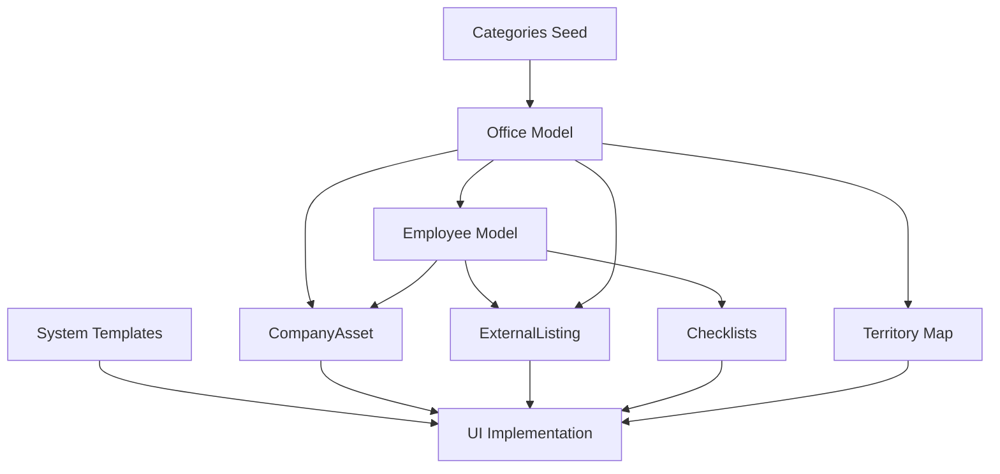
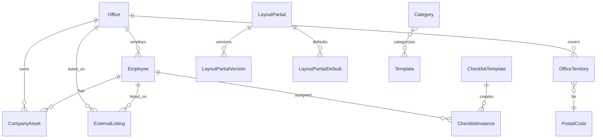

# V3 Consolidated Feature Plan

**Status:** Ready for Agent Pipeline  
**Created:** 2026-01-17  
**Supersedes:** `feature_expansion_plan_48a53a74.plan.md`, `expanded_feature_plan_2d4d0245.plan.md`

---

## Executive Summary

This plan consolidates two feature expansion plans into a single comprehensive scope covering:

1. **Office & Employee Hub** - Full company data CRM with lifecycle management
2. **Company Assets** - File storage scoped to global/office/employee
3. **Territory Map** - Postal code heatmap with multi-layer support
4. **Document Categories** - Seed 97 Vitec categories
5. **Enhanced System Templates** - Versioning and default assignment rules

---

## Feature 1: Office & Employee Hub

A centralized CRM for company data with employee lifecycle tracking.

### 1.1 Office Model

```python
class Office(Base):
    id: UUID
    name: str                      # "Proaktiv Stavanger"
    short_code: str                # "STAV" - unique, for filtering
    
    # Contact
    email: str
    phone: str
    
    # Address
    street_address: str
    postal_code: str
    city: str
    
    # Online Presence
    homepage_url: str
    google_my_business_url: str
    facebook_url: str
    instagram_url: str
    linkedin_url: str
    
    # Territory Map
    color: str                     # Hex color for heatmap
    
    # Status
    is_active: bool
    created_at, updated_at
```

### 1.2 Employee Model

```python
class Employee(Base):
    id: UUID
    office_id: UUID                # FK to offices
    
    # Basic Info
    first_name: str
    last_name: str
    title: str                     # "Eiendomsmegler"
    
    # Contact
    email: str
    phone: str
    
    # Online Presence
    homepage_profile_url: str
    linkedin_url: str
    
    # Employment Lifecycle
    status: str                    # 'active' | 'onboarding' | 'offboarding' | 'inactive'
    start_date: date
    end_date: date | None
    
    # Offboarding Timeline
    hide_from_homepage_date: date | None
    delete_data_date: date | None
    
    created_at, updated_at
```

### 1.3 External Listing Model (Third-Party Tracking)

```python
class ExternalListing(Base):
    id: UUID
    
    # Link to office or employee
    office_id: UUID | None
    employee_id: UUID | None
    
    # Listing Details
    source: str                    # 'anbudstjenester' | 'finn' | 'nummeropplysning' | 
                                   # '1881' | 'gulesider' | 'google' | 'other'
    listing_url: str
    listing_type: str              # 'office' | 'broker' | 'company'
    
    # Verification
    status: str                    # 'verified' | 'needs_update' | 'pending_check' | 'removed'
    last_verified_at: datetime
    last_verified_by: str
    notes: str
    
    created_at, updated_at
```

### 1.4 Checklist Models (Onboarding/Offboarding)

```python
class ChecklistTemplate(Base):
    id: UUID
    name: str                      # "New Employee Onboarding"
    description: str
    type: str                      # 'onboarding' | 'offboarding'
    items: list[dict]              # JSONB: [{name, description, required, order}]
    is_active: bool
    created_at, updated_at

class ChecklistInstance(Base):
    id: UUID
    template_id: UUID
    employee_id: UUID
    status: str                    # 'in_progress' | 'completed' | 'cancelled'
    items_completed: list[str]     # JSONB
    due_date: date
    completed_at: datetime | None
    created_at, updated_at
```

### 1.5 API Endpoints

| Method | Endpoint | Description |
|--------|----------|-------------|
| GET | `/api/offices` | List offices (filter: city, is_active) |
| POST | `/api/offices` | Create office |
| GET | `/api/offices/{id}` | Get office with employees, assets |
| PUT | `/api/offices/{id}` | Update office |
| DELETE | `/api/offices/{id}` | Deactivate office |
| GET | `/api/employees` | List employees (filter: office_id, status) |
| POST | `/api/employees` | Create employee |
| GET | `/api/employees/{id}` | Get employee with assets, checklists |
| PUT | `/api/employees/{id}` | Update employee |
| DELETE | `/api/employees/{id}` | Deactivate employee |
| GET | `/api/external-listings` | List listings (filter: office_id, employee_id, status) |
| POST | `/api/external-listings` | Create listing |
| PUT | `/api/external-listings/{id}` | Update listing |
| POST | `/api/external-listings/{id}/verify` | Mark as verified |
| GET | `/api/checklists/templates` | List templates |
| POST | `/api/checklists/templates` | Create template |
| GET | `/api/checklists/instances` | List instances (filter: employee_id, status) |
| POST | `/api/checklists/instances` | Assign checklist to employee |
| PUT | `/api/checklists/instances/{id}` | Update progress |

---

## Feature 2: Company Assets

File storage with scoping to global, office, or employee.

### 2.1 Model

```python
class CompanyAsset(Base):
    id: UUID
    
    # Ownership (one of these defines scope)
    office_id: UUID | None
    employee_id: UUID | None
    is_global: bool                # Company-wide assets
    
    # File Info
    name: str                      # Display name
    filename: str                  # Original filename
    category: str                  # 'logo' | 'photo' | 'marketing' | 'document' | 'other'
    content_type: str              # MIME type
    file_data: bytes               # PostgreSQL BYTEA
    file_size: int
    
    # Metadata
    metadata: dict                 # JSONB: {dimensions, alt_text, usage_notes}
    
    created_at, updated_at
```

### 2.2 API Endpoints

| Method | Endpoint | Description |
|--------|----------|-------------|
| GET | `/api/assets` | List assets (filter: category, office_id, employee_id, is_global) |
| POST | `/api/assets/upload` | Upload file (multipart/form-data) |
| GET | `/api/assets/{id}` | Get asset metadata |
| GET | `/api/assets/{id}/download` | Download file |
| PUT | `/api/assets/{id}` | Update metadata |
| DELETE | `/api/assets/{id}` | Delete asset |

---

## Feature 3: Territory Map (Markedsområde)

Heatmap showing postal code allocations per office with multi-layer support.

### 3.1 Models

```python
class PostalCode(Base):
    postal_code: str               # PK, e.g., "0001"
    postal_name: str               # e.g., "OSLO"
    municipality_code: str
    municipality_name: str
    category: str                  # 'G' (street), 'B' (PO box), etc.
    created_at, updated_at

class OfficeTerritory(Base):
    id: UUID
    office_id: UUID                # FK to offices
    postal_code: str               # FK to postal_codes
    source: str                    # 'vitec_next' | 'finn' | 'anbudstjenester' | 'homepage' | 'other'
    priority: int                  # Higher overrides lower
    is_blacklisted: bool           # Area we don't cover
    valid_from: date
    valid_to: date | None
    created_at, updated_at
```

### 3.2 Data Sources

1. **Bring Postnummerregister** - https://www.bring.no/postnummerregister-ansi.txt
2. **Vitec Next Export** - Master office allocations
3. **Third-party Overrides** - Finn, Anbudstjenester, etc.
4. **Blacklist** - Areas outside coverage

### 3.3 API Endpoints

| Method | Endpoint | Description |
|--------|----------|-------------|
| GET | `/api/postal-codes` | List all postal codes |
| POST | `/api/postal-codes/sync` | Sync from Bring registry |
| GET | `/api/territories` | List territories (filter: office_id, source) |
| GET | `/api/territories/map` | GeoJSON for heatmap |
| GET | `/api/territories/layers` | Available source layers |
| POST | `/api/territories/import` | Import from CSV/Excel |
| GET | `/api/territories/blacklist` | Blacklisted postal codes |
| POST | `/api/territories/blacklist` | Add to blacklist |

---

## Feature 4: Document Categories Seeding

Populate categories table with 97 Vitec Next categories.

### 4.1 Data Source

`.cursor/vitec-reference.md` contains the complete list with:
- Category IDs 0-170 (non-sequential)
- Document folder associations

### 4.2 Implementation

1. Add `vitec_id: int` column to Category model
2. Create seed script: `backend/scripts/seed_vitec_categories.py`
3. Map Vitec folder associations to metadata JSONB

---

## Feature 5: Enhanced System Templates

Extend LayoutPartial with versioning and default assignment rules.

### 5.1 Model Updates

```python
# Add stilark to existing type constraint
class LayoutPartial(Base):
    # Existing fields...
    type: str  # 'header' | 'footer' | 'signature' | 'stilark'

# New: Version history
class LayoutPartialVersion(Base):
    id: UUID
    partial_id: UUID               # FK to layout_partials
    version_number: int
    html_content: Text
    change_notes: str
    created_at: datetime
    created_by: str

# New: Default assignment rules
class LayoutPartialDefault(Base):
    id: UUID
    partial_id: UUID               # FK to layout_partials
    scope: str                     # 'all' | 'category' | 'medium'
    category_id: UUID | None       # If scope='category'
    medium: str | None             # If scope='medium': 'pdf', 'email', 'sms'
    priority: int                  # For conflict resolution
    created_at, updated_at
```

### 5.2 API Endpoints

| Method | Endpoint | Description |
|--------|----------|-------------|
| GET | `/api/layout-partials/{id}/versions` | List version history |
| POST | `/api/layout-partials/{id}/versions` | Create new version |
| GET | `/api/layout-partials/{id}/versions/{version}` | Get specific version |
| POST | `/api/layout-partials/{id}/revert/{version}` | Revert to version |
| GET | `/api/layout-partials/defaults` | List default rules |
| POST | `/api/layout-partials/defaults` | Create default rule |
| PUT | `/api/layout-partials/defaults/{id}` | Update rule |
| DELETE | `/api/layout-partials/defaults/{id}` | Delete rule |

---

## UI Pages Summary

| Page | Description |
|------|-------------|
| `/offices` | Office grid with filters, status badges |
| `/offices/{id}` | Office detail with employees, assets, territory, listings |
| `/employees` | Employee grid with office sidebar filter |
| `/employees/{id}` | Employee profile with assets, checklists, listings |
| `/assets` | Global asset gallery with category tabs |
| `/territories` | Interactive Norway heatmap with layer toggles |
| `/system-templates` | Headers/footers/signatures/stilark with versioning |

---

## Agent Pipeline

```
┌─────────────────────────────────────────────────────────────────┐
│                     AGENT PIPELINE                               │
├─────────────────────────────────────────────────────────────────┤
│                                                                  │
│  Phase 1: Systems Architect (/architect)                        │
│  ├── Output: .cursor/specs/backend_spec.md                      │
│  ├── Scope:                                                     │
│  │   • All database models and migrations                       │
│  │   • API endpoint specifications                              │
│  │   • Service layer interfaces                                 │
│  │   • Pydantic schemas                                         │
│  └── Features: 1, 2, 3, 4, 5                                    │
│                                                                  │
│                         ↓                                        │
│                                                                  │
│  Phase 2: Frontend Architect (/frontend-architect)              │
│  ├── Output: .cursor/specs/frontend_spec.md                     │
│  ├── Scope:                                                     │
│  │   • Page layouts and component hierarchy                     │
│  │   • React hooks and state management                         │
│  │   • API client functions                                     │
│  │   • Filtering/sorting behavior                               │
│  └── Features: 1, 2, 3, 4, 5                                    │
│                                                                  │
│                         ↓                                        │
│                                                                  │
│  Phase 3: Builder (/builder)                                    │
│  ├── Input: Both spec files                                     │
│  ├── Implementation Order:                                      │
│  │   1. Feature 4: Seed categories (quick win, unblocks)        │
│  │   2. Feature 1a: Office model                                │
│  │   3. Feature 1b: Employee model                              │
│  │   4. Feature 2: CompanyAsset with scoping                    │
│  │   5. Feature 1c: ExternalListing                             │
│  │   6. Feature 1d: Checklists                                  │
│  │   7. Feature 5: System template enhancements                 │
│  │   8. Feature 3: Territory map (depends on offices)           │
│  │   9. UI: All pages and components                            │
│  └── Testing: Each feature before moving to next                │
│                                                                  │
└─────────────────────────────────────────────────────────────────┘

---

## Implementation Progress

### V3.0 Features (In Order)
1. [x] Seed 97 Vitec categories with vitec_id
2. [x] Office model + CRUD + UI
3. [x] Employee model + lifecycle + UI  
4. [x] Company Assets with scoping
5. [x] External Listings (third-party tracking)
6. [x] Checklists (onboarding/offboarding)
7. [x] Territory Map (postal code heatmap)
8. [x] System template versioning + defaults
9. [ ] Bulk operations for templates
10. [ ] Template version history UI

---

## Implementation Dependencies



---

## Database Migration Order

1. `0010_add_vitec_id_to_categories.py` - Add vitec_id column
2. `0011_create_offices_table.py` - Office model
3. `0012_create_employees_table.py` - Employee model  
4. `0013_create_company_assets_table.py` - CompanyAsset model
5. `0014_create_external_listings_table.py` - ExternalListing model
6. `0015_create_checklists_tables.py` - ChecklistTemplate, ChecklistInstance
7. `0016_create_postal_codes_table.py` - PostalCode model
8. `0017_create_office_territories_table.py` - OfficeTerritory model
9. `0018_add_layout_partial_versioning.py` - LayoutPartialVersion, LayoutPartialDefault
10. `0019_update_layout_partial_types.py` - Add 'stilark' type

---

## Frontend Dependencies

| Package | Purpose |
|---------|---------|
| react-dropzone | File upload drag-drop |
| leaflet / react-leaflet | Territory heatmap |
| @tanstack/react-query | Data fetching (already installed) |
| recharts | Analytics charts (already installed) |

---

## Data Flow



---

## Success Criteria

| Feature | Criteria |
|---------|----------|
| Offices | CRUD operations, employee count display |
| Employees | Lifecycle status tracking, office filtering |
| Assets | Upload/download, category filtering, scoping works |
| External Listings | Verification workflow, status badges |
| Checklists | Template creation, instance progress tracking |
| Territories | Heatmap renders, layer toggles work |
| Categories | 97 categories seeded with vitec_id |
| System Templates | Version history, default rules apply |

---

## Next Steps

1. **Start new chat** → Run `/architect` with this plan
2. **Start new chat** → Run `/frontend-architect` with backend spec
3. **Start new chat** → Run `/builder` with both specs
